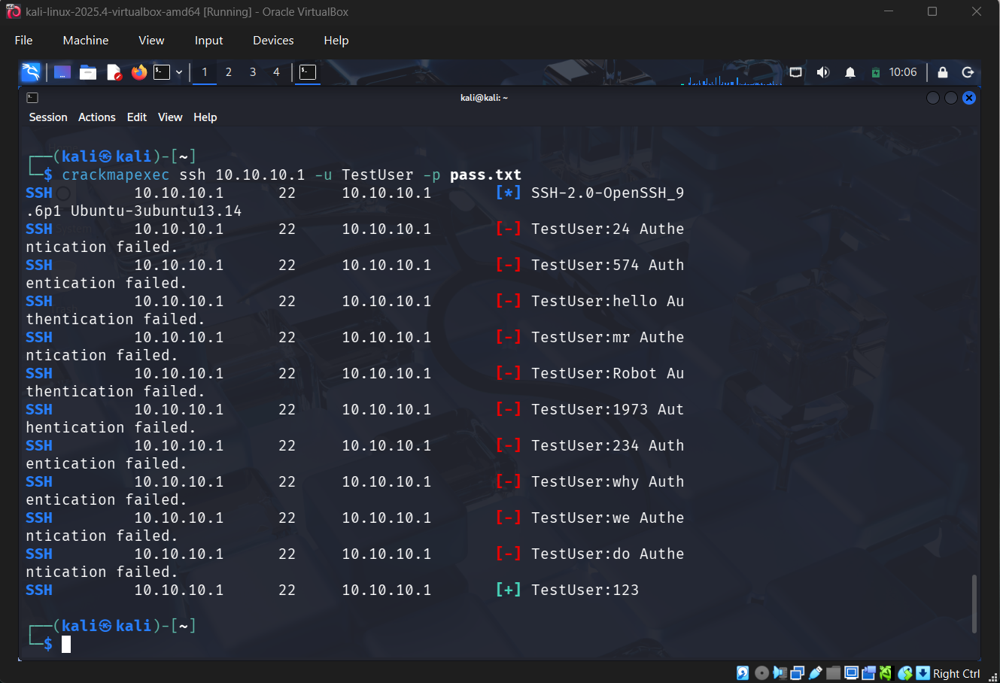
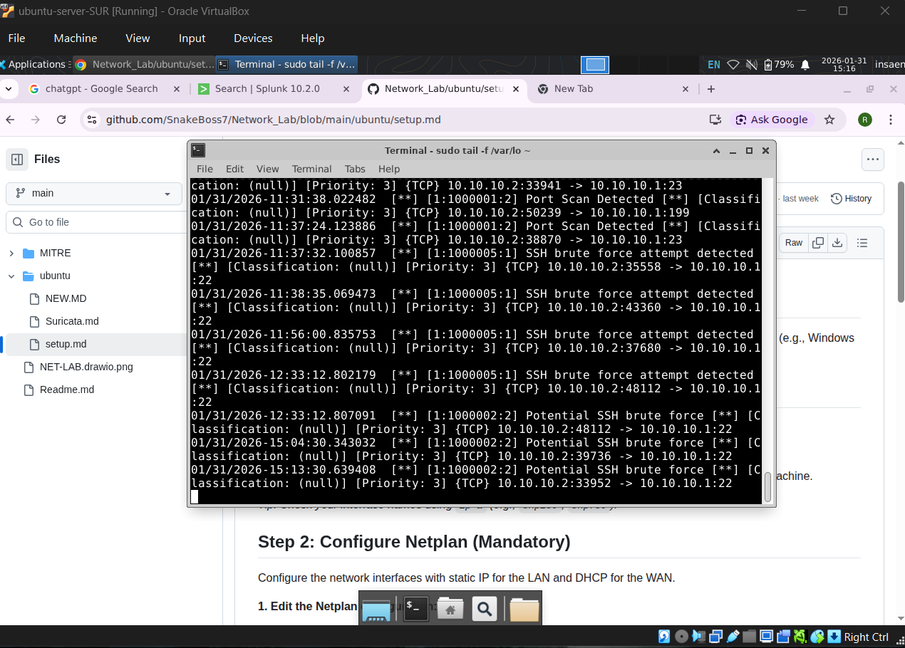
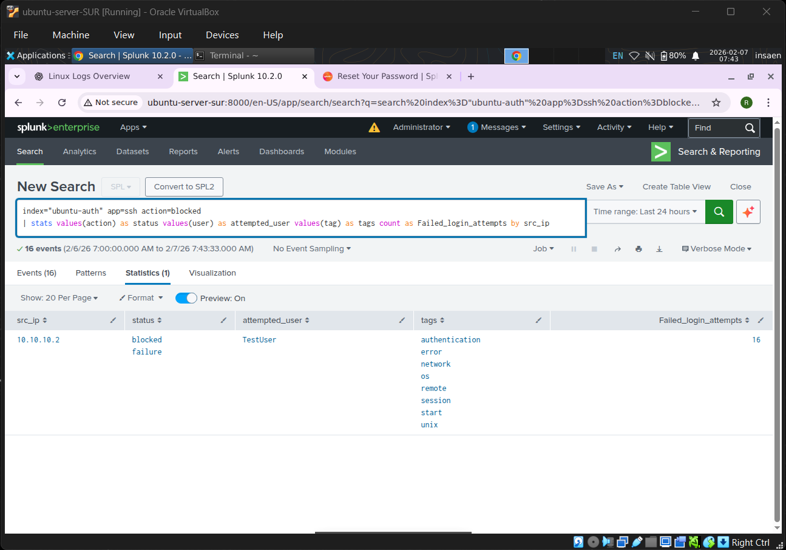
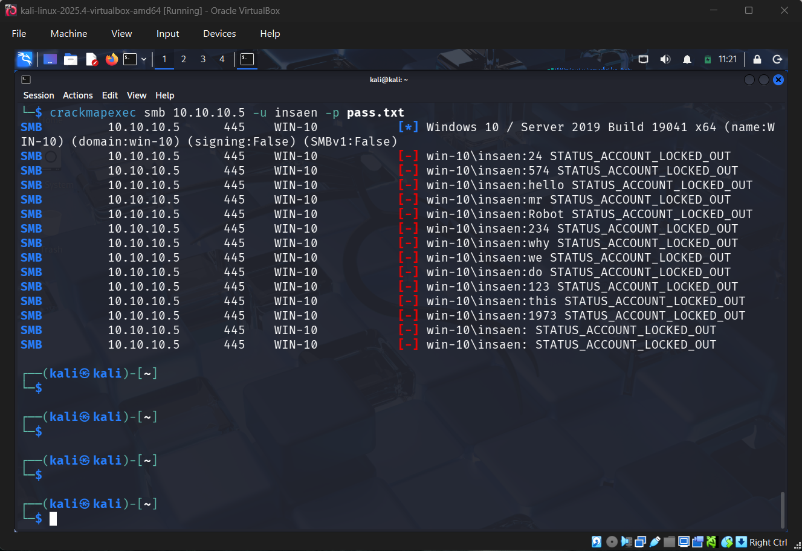
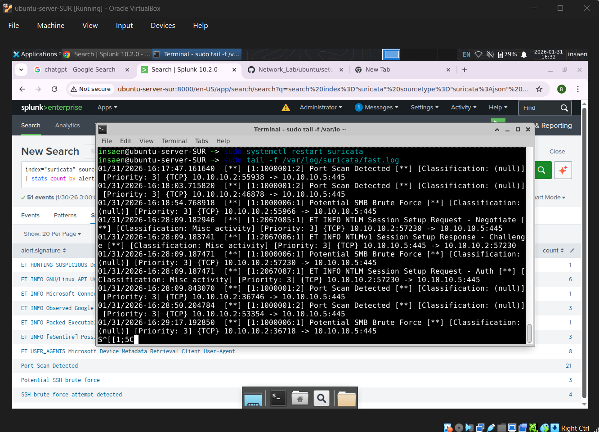

# Brute Force Attack
Brute Force Attack is a type of attack where an attacker tries to guess the password of a user by trying all possible combinations of characters.

## SSH brute force
### Attack
```
crackmapexec ssh 10.10.10.1 -u TestUser -p pass.txt
```


### Detection
#### Suricata
In suricata we used signature based detection. Where ssh connections uses TCP and are done on 22 port number ,and SSH connection requries full tcp handshake to be done.
```
alert tcp any any -> $HOME_NET 22(
    msg:"Potential SSH Brute Force Attack";
    flow:to_server,established;
    threshold: type both, track by_src, count 10, seconds 60;
    sid:1000002;
    rev:1;
    )
```


#### Splunk Detection using auth.log
In splunk we used Auth attempt done through a src_ip or we can say remotely. Where we used the auth.log file to detect the brute force attacks.
index="ubuntu-auth" app=ssh action=blocked
| stats values(action) as status values(user) as attempted_user values(tag) as tags count as Failed_login_attempts by src_ip



## SMB brute force
### Attack
```
crackmapexec smb 10.10.10.5 -u insaen -p pass.txt
```


### Suricata
```
alert tcp any any -> $HOME_NET 445(
    msg:"Potential SMB Brute Force Attack";
    flow:to_server,established;
    threshold: type both, track by_src, count 10, seconds 60;
    sid:1000003;
    rev:1;
)
```

