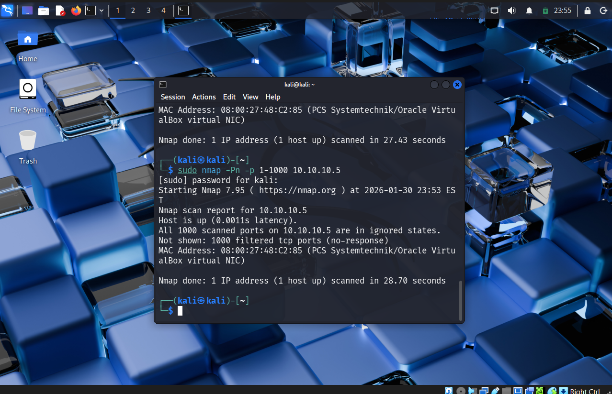
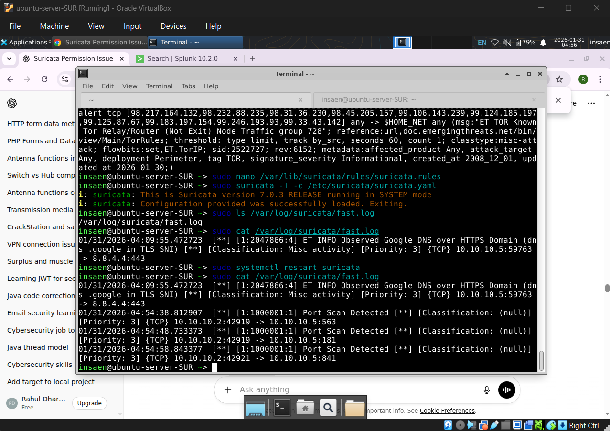

# Port Scan Reconnaissance

> **MITRE ATT&CK Technique:** T1046 - Network Service Discovery 
> **Tactic:** TA0043 - Reconnaissance

---

## Description
Port Scanning is a reconnaissance technique used to identify **open ports** and **running services** on a target system. Attackers use this to map the attack surface before exploitation.
### Command Example

```bash
sudo nmap <scan-type> -Pn -p 1-1000 10.10.10.5
```



---

## Detection Methods

### 1. Suricata (Signature-Based Detection)

#### TCP-SYN Scan (`-sS`)

In a typical scan, Nmap uses TCP and builds a **half-open connection** by sending only a SYN packet and receiving an ACK (if any). This **does not complete** the three-way handshake.

| Property | Value |
|----------|-------|
| **Protocol** | TCP |
| **Nmap Flag** | `-sS` |
| **Detection** | High visibility |

```suricata
alert tcp any any -> $HOME_NET any (
    msg:"Potential Port Scan Detected";
    flags:S;                                                    # SYN flag
    flow:stateless;                                             # Stateless - no full handshake
    threshold:type both, track by_src, count 30, seconds 60;
    sid:1000001;
    rev:1;
)
```

> **Limitation:** This can potentially fail on slow scans — that's when **Zeek** comes in.

---

#### UDP Scan (`-sU`)

In UDP scans, Nmap uses the UDP protocol, which makes it **stealthier** due to the absence of a handshake, but also **less accurate**.

| Property | Value |
|----------|-------|
| **Protocol** | UDP |
| **Nmap Flag** | `-sU` |
| **Detection** | Medium visibility |

**Why is it stealthier?**
- No flags
- No handshake
- No special flow
- Slower scan rate

```suricata
alert udp any any -> $HOME_NET any (
    msg:"Potential UDP Port Scan Detected";
    flow:stateless;                                             # No session maintained
    threshold:type both, track by_src, count 10, seconds 60;
    sid:1000002;
    rev:1;
)
```

---

#### FIN Scan (`-sF`)

In a FIN scan, only the **FIN flag** is used. This can bypass basic firewalls but has limitations — it **does not work properly on Windows** systems, which send RST for both closed and open ports.

| Property | Value |
|----------|-------|
| **Protocol** | TCP |
| **Nmap Flag** | `-sF` |
| **Detection** | Medium visibility |

**Why is it stealthier?**
- No SYN flag
- No handshake
- No special flow

```suricata
alert tcp any any -> $HOME_NET any (
    msg:"Potential FIN Port Scan Detected";
    flags:F;                                                    # FIN flag
    flow:stateless;                                             # No session maintained
    threshold:type both, track by_src, count 10, seconds 60;
    sid:1000003;
    rev:1;
)
```

> **Limitation:** These UDP and FIN are slow scans so detectino can be avoided — that's when **Zeek** comes in.



---

### 2. Splunk + Zeek (Behavioral Detection)

For slow scans and evasive techniques, behavioral analysis with **Zeek logs** in **Splunk** provides better detection.

```spl
index="zeek" 
| stats dc(id.dest_p) as Unique_ports values(id.dest_p) as ports by id.dest_h id.resp_h
| where Unique_ports > 30
```


---

## Quick Summary

| Scan Type | App Logs | Firewall Logs | IDS Visibility |
|-----------|----------|---------------|----------------|
| `-sT` (TCP Connect) | Yes | Yes | High |
| `-sS` (SYN Stealth) | No | Yes | High |
| `-sF` (FIN Scan) | No | Maybe | Medium |
| `-sU` (UDP Scan) | No | ICMP | Medium |


