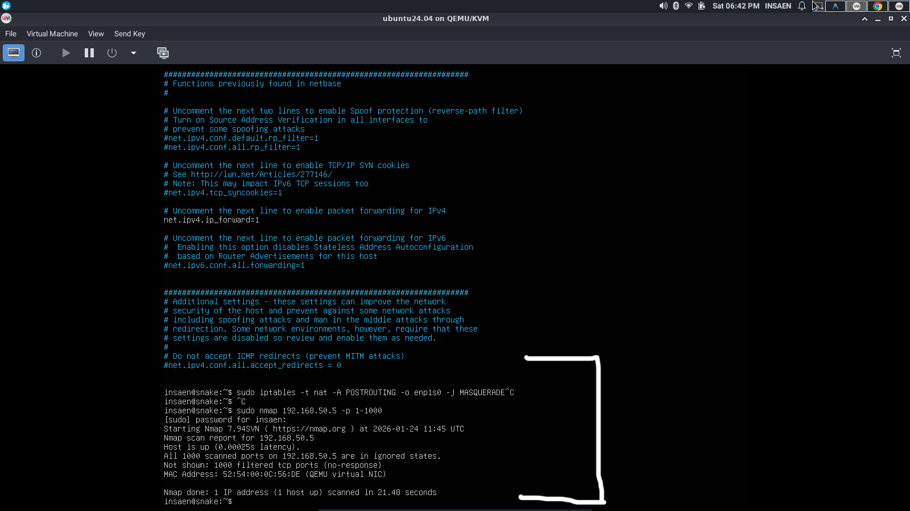

# Port Scan
## Description
Port Scanning is basically a reconnaissance technique used to identify open ports on a target system.
cmd
```
sudo nmap -p- 192.168.50.5
```


#### Detection
```
index="suricata-win11" 
| stats dc(dest_port) as Unique_ports  values(dest_port) as ports by dest_ip src_ips
| where Unique_ports > 30
```
.png)