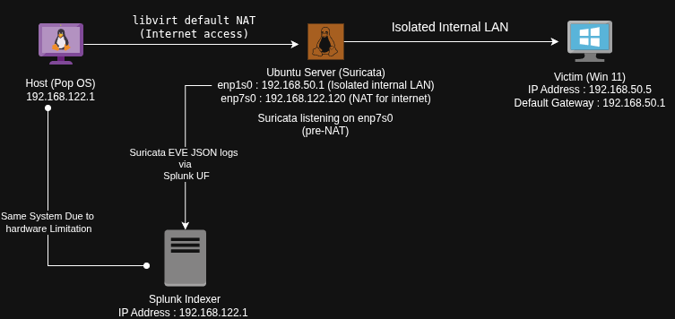

# Network Lab
## Setup
- pop os 
    - host
    - Attacker
    - Splunk Indexer
- 2 VMs
    - win 11 (Victim)
    - Ubuntu Server (Suricata, Splunk UF)
## Architechture

## Attack Simulation & Detection (Atomic Red Team)
### Simulated attacks used to test and validate the detection pipeline.

####  TA0043 - Reconnaissance
- [Port Scan](./MITRE/TA0043-Reconnaissance/PortScan.md)

